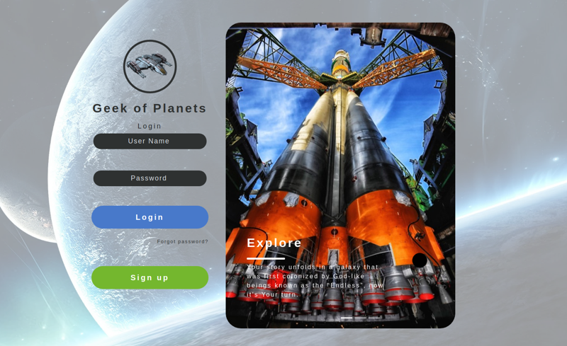

# Geek of planets

## Description

Geek of planets is a MMO web game in browser. The game's story takes place in space, where you lead a galaxy empire.

The application was created as a final big project at [CodeCool](https://codecool.com/en/) school.

## Screenshots

## Used technologies:

## Team:

- Przemyslaw Guszek
- Dominik Lach
- Piotr Janiszewski
- Piotr Mludzik
- Magdalena Podolewska
- Przemyslaw Stolarz

## Challenges:

- big project
- many new technologies

## Contact info

Feel free to contact anyone of us in case of any issues, questions or comments.

## License

Copyright (c) 2021 by Przemyslaw Guszek, Dominik Lach, Piotr Janiszewski, Piotr Mludzik, Magdalena Podolewska, Przemyslaw Stolarz. All rights reserved.  
Code in this repository is licensed under MIT license. See [LICENSE](https://github.com/piotrmludzik/elGrande/blob/master/LICENSE).
